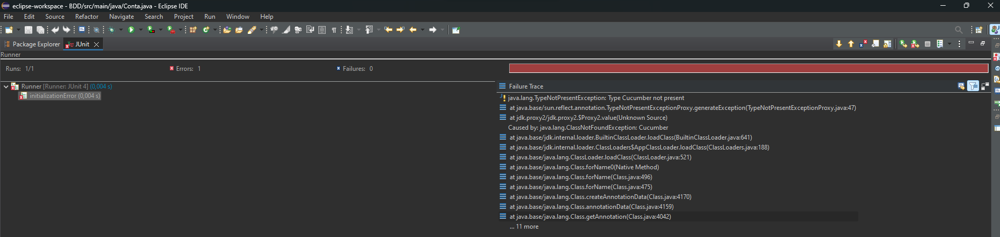

# BDD

# Sobre o projeto

Este projeto tem como base a aplicação do Behavior-Driven Development (BDD) por meio da ferramenta cucumber, para se realizar testes de aplicação em uma conta bancaria.
Juntamente aplicando o uso do JUnit

# Projeto

@tag
Feature: Cliente faz saque dde dinheiro como um cliente,
eu gostaria de sacr dinheiro em um caixa eletronico,
  para que eu não tenha que esperar em uma fila de banco.

  @tag1
  Scenario: cliente especial com saldo negativo
    Given um cliente especial com saldo atual de -200 reais
    When for solicitado um saque no valor de 100 reais
    Then deve efetuar o saque e atualizar o saque da conta para -100 reais
    And check more outcomes

  @tag2
  Scenario Outline: cliente comun com saldo negativo
    Given um cliente comun com saldo atual de -200 reais
    When solicitar um saque de 200 reais
    Then não deve efetuar o saque e deve retornar a mensagem saldo insuficiente

    Examples: 
      | name  | value | status  |
      | name1 |     5 | success |
      | name2 |     7 | Fail    |

  #Imagem de retorno do console
  
Erro

